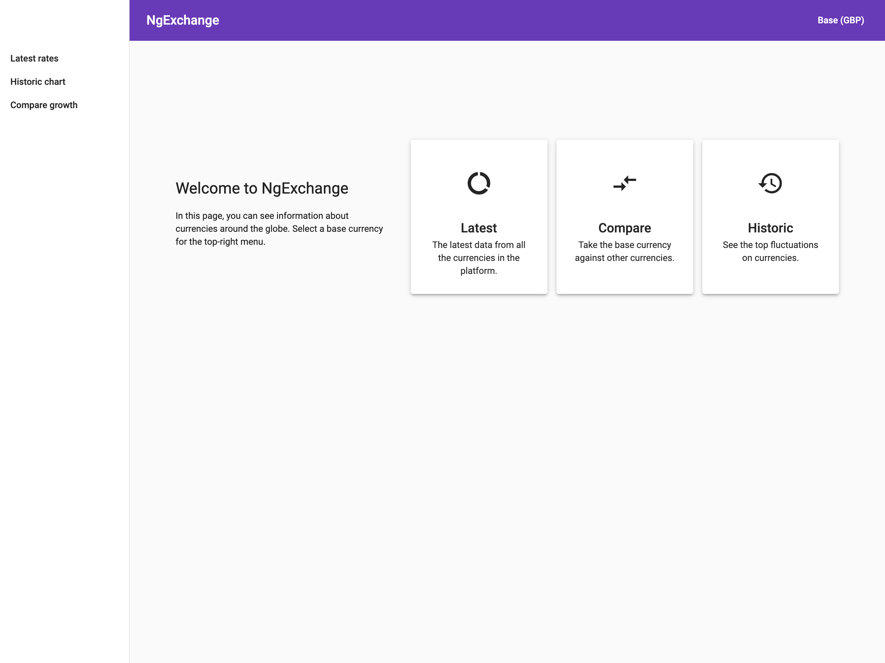
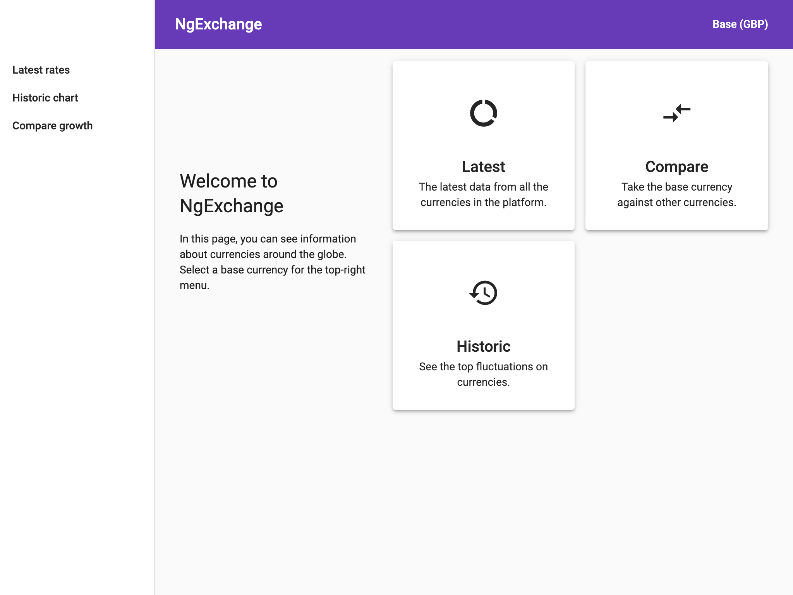
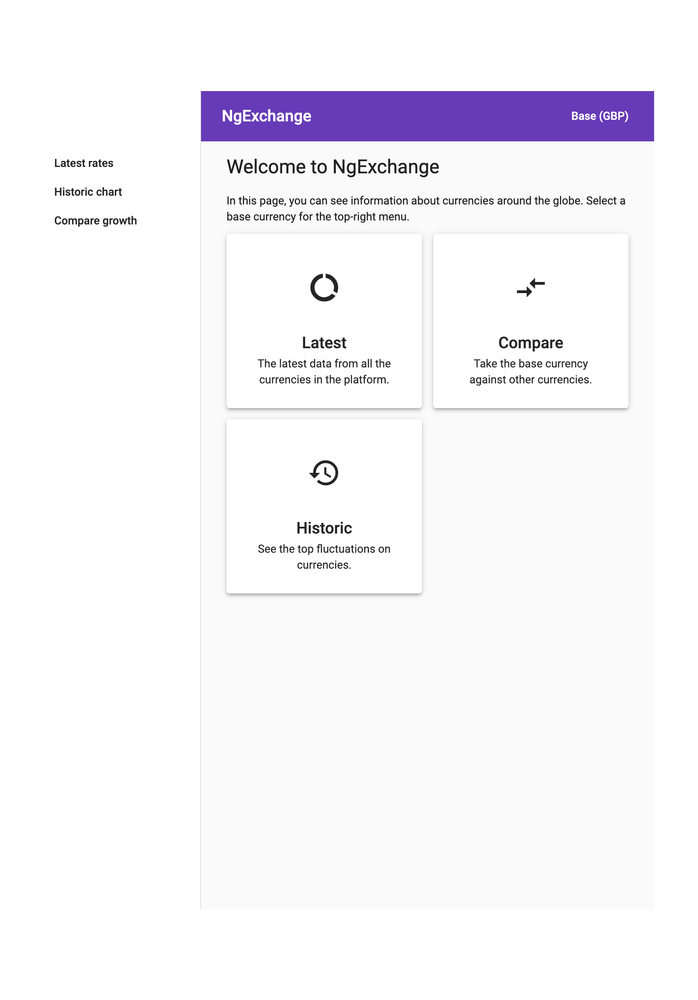
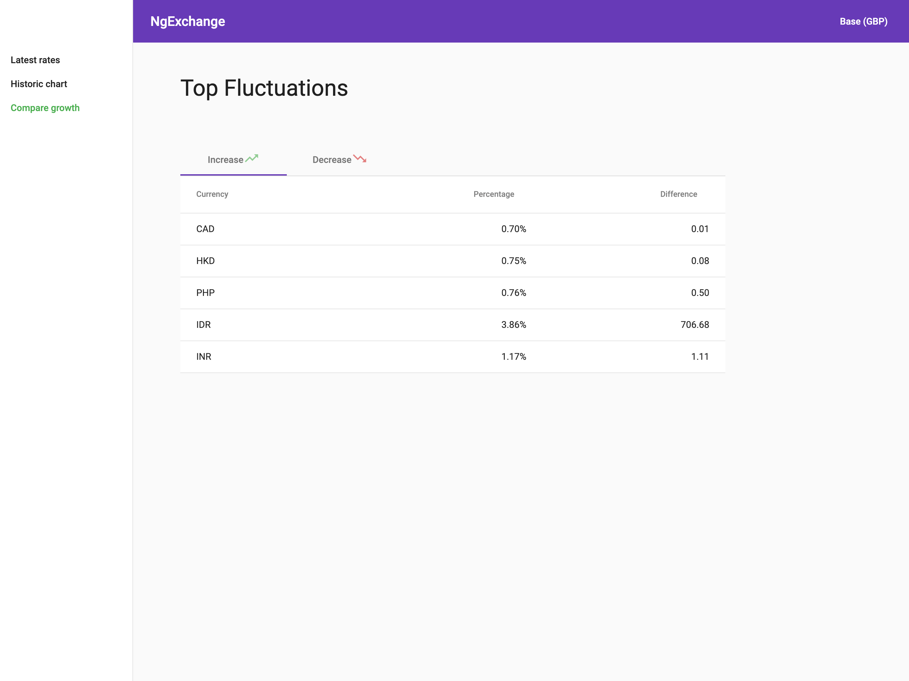

# Ngexchange

> This project was generated with [Angular CLI](https://github.com/angular/angular-cli) version 9.0.3.

Display tables and charts based on data from [https://exchangeratesapi.io/](https://exchangeratesapi.io/).

I didn't use any state manager because it's a small application, and the only shared state fits perfectly on a simple service.

## Development server

### Requirements

* Node>=10

### Steps

1. Clone/Download this repo.
2. Install dependencies (`npm install` / `yarn install`)
3. Run `npm start` for a dev server. Navigate to `http://localhost:4200/`. The app will automatically reload if you change any of the source files.

## Screenshots

